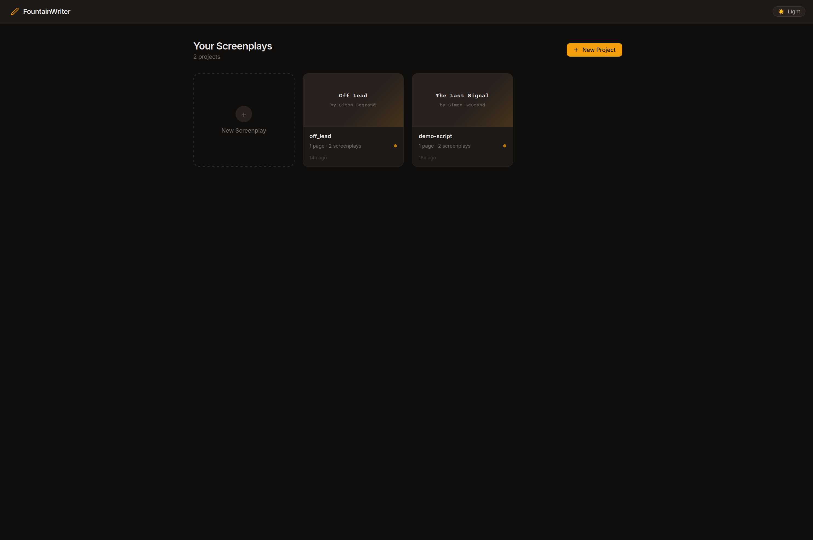
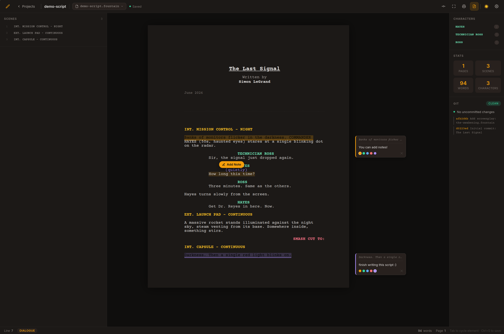
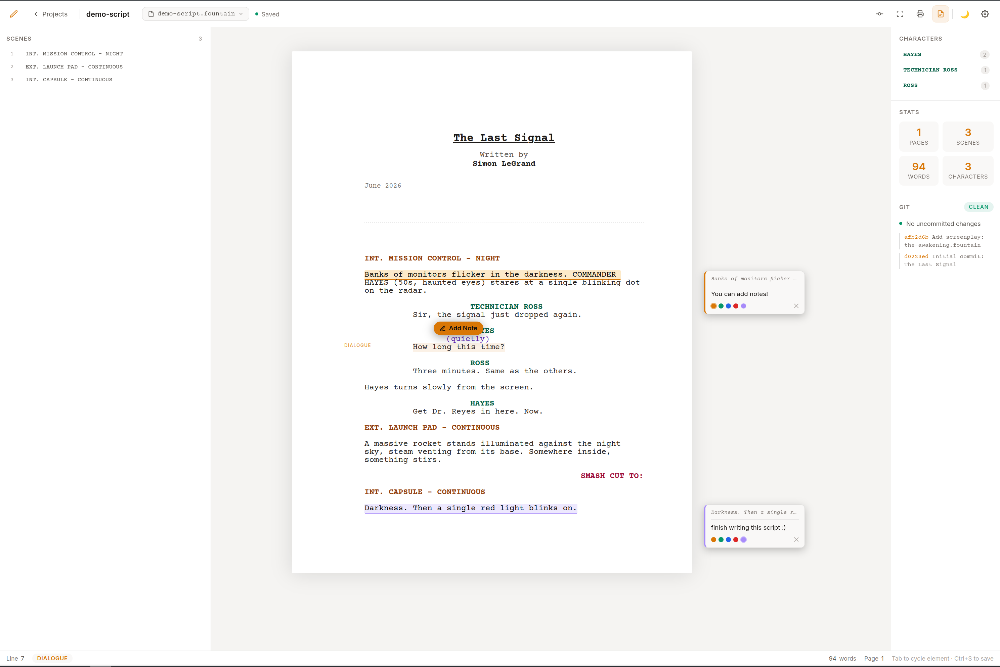
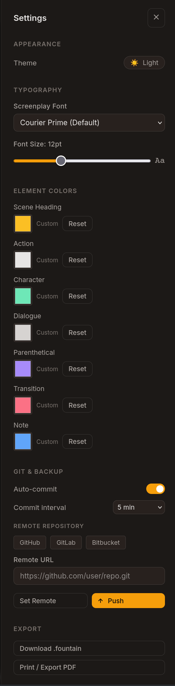

# FountainWriter

A sleek, web-based screenplay editor that works natively with the [Fountain](https://fountain.io) format. Built for writers who want a distraction-free, professional writing environment with automatic git backup.









---

## Features

**Writing**
- Native `.fountain` format — files are plain text you can open anywhere
- Tab key cycles element types: Action → Scene Heading → Character → Transition
- Context-aware Enter key: Character → Dialogue, Dialogue → Action
- A4 portrait page layout with visual page breaks
- Courier Prime font by default (customizable)
- Autocomplete for character names and scene headings
- Character tally and scene navigator in the sidebar

**Projects**
- Project management page — create, open, and delete projects
- Multiple screenplays per project
- Import existing `.fountain` files at project creation or from inside the editor
- Fancy title page creation with live preview

**Margin Notes**
- Highlight any text and click **Add Note** to pin a note in the right margin
- Notes scroll with the page and stay aligned with their highlighted line
- Color-code notes (amber, green, blue, red, purple)
- Toggle all notes on/off with the toolbar button or press `N`
- Notes saved as `.notes.json` alongside each screenplay

**Git Backup**
- Every project has its own git repository
- Auto-commit on a configurable interval (3 – 30 min)
- Manual commit with Ctrl+S
- Connect any remote: GitHub, GitLab, Bitbucket, or a custom URL
- Full commit history visible in the sidebar

**Customisation**
- Dark and light themes
- Custom colours for every Fountain element type
- Adjustable font and font size
- Resizable scene navigator panel (drag the right edge)

**Desktop integration (Linux)**
- `.desktop` launcher — appears in your app launcher
- `fountainwriter` shell alias for quick terminal launch
- Smart launcher: opens browser instantly if server is already running

---

## Prerequisites

- [Node.js](https://nodejs.org) v18 or later
- npm (included with Node.js)
- A modern browser (Chrome, Firefox, Edge)
- git (for the backup feature)

---

## Installation

```bash
# 1. Clone the repository
git clone https://github.com/YOUR_USERNAME/FountainWriter.git
cd FountainWriter

# 2. Install dependencies
npm install

# 3. Start the server
npm start
```

Then open **http://localhost:3737** in your browser.

> Your screenplays are stored in `~/FountainProjects/` — one folder per project, each with its own git repository.

### Development mode (auto-restart on file changes)

```bash
npm run dev
```

---

## Desktop integration (Linux)

### App launcher

```bash
# Copy the desktop entry
cp linux/fountainwriter.desktop ~/.local/share/applications/

# Copy the icon
mkdir -p ~/.local/share/icons/hicolor/128x128/apps
cp linux/fountainwriter.png ~/.local/share/icons/hicolor/128x128/apps/

# Update the desktop database
update-desktop-database ~/.local/share/applications/
```

Edit `~/.local/share/applications/fountainwriter.desktop` and update the `Exec=` path to point to `launch.sh` in your installation directory.

### Shell alias

Add to your `~/.bashrc` or `~/.zshrc`:

```bash
alias fountainwriter='/path/to/FountainWriter/launch.sh'
```

The launcher script checks whether the server is already running and skips the startup wait if so, then opens your browser.

---

## Usage

### Keyboard shortcuts

| Key | Action |
|-----|--------|
| `Tab` | Cycle element type (Action → Scene Heading → Character → Transition) |
| `Enter` | Context-aware new block (after Character → Dialogue, after Dialogue → Action) |
| `Ctrl+S` | Save and commit to git |
| `F11` | Focus mode (hides all UI chrome) |
| `N` | Toggle margin notes on/off |

### Element types

FountainWriter uses the full [Fountain specification](https://fountain.io/syntax):

| Element | How to create |
|---------|--------------|
| Scene Heading | Tab until `SCENE HEADING` appears, or start with `INT.` / `EXT.` |
| Action | Default element type |
| Character | Tab until `CHARACTER` appears, or type in ALL CAPS |
| Dialogue | Enter after a Character line |
| Parenthetical | `(` at the start of a line inside dialogue |
| Transition | Tab until `TRANSITION` appears |
| Note | `[[` at the start of a line |
| Centered | `>text<` |
| Lyric | `~` at the start of a line |

### Margin notes

1. Select any text in the screenplay
2. Click the **Add Note** amber button that appears above the selection
3. Type your note in the card that appears in the right margin
4. Click a colour dot to colour-code the note
5. Press `N` to hide all notes when you want a clean view

### Git backup

Each project has its own git repo in `~/FountainProjects/<project-name>/`. FountainWriter auto-commits on a timer (default 5 minutes). To connect a remote:

1. Open **Settings** (gear icon)
2. Under **Git & Backup → Remote Repository**, click GitHub / GitLab / Bitbucket or paste a custom URL
3. Click **Set Remote**, then **Push**

---

## Project structure

```
FountainWriter/
├── server.js              # Express API + static file server
├── launch.sh              # Smart launcher (checks if server running)
├── package.json
├── public/
│   ├── index.html         # Projects page
│   ├── editor.html        # Editor page
│   ├── css/
│   │   └── styles.css     # All styles, CSS custom properties for theming
│   ├── js/
│   │   ├── fountain-parser.js   # Fountain parse/serialize (runs in browser + Node)
│   │   ├── editor.js            # Editor logic, notes, file switcher, git UI
│   │   └── projects.js          # Projects page logic, import handling
│   └── fonts/             # Courier Prime font files
└── screenshots/
```

**Screenplay storage** (`~/FountainProjects/`):

```
FountainProjects/
└── my-project/
    ├── my-project.fountain        # Main screenplay
    ├── second-draft.fountain      # Additional screenplays (optional)
    ├── my-project.notes.json      # Margin notes for my-project.fountain
    └── .git/                      # Per-project git repository
```

---

## Tech stack

- **Backend**: Node.js + Express — REST API, serves static files, wraps `simple-git`
- **Frontend**: Vanilla JS, no build step — each Fountain element is a `contenteditable` div
- **Git**: `simple-git` npm package — per-project repos in `~/FountainProjects/`
- **Font**: Courier Prime (Google Fonts, with Courier New fallback)

---

## License

MIT — see [LICENSE](LICENSE)
